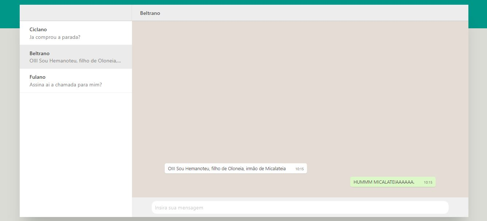

## Project setup
npm install
npm run serve
npm run build

# Introdução 
É um clone do chat do whatsapp web, nele da para digitar e aparece na area de mensagem, mantendo todo o layout, igual o whatsapp.
Feito para exercitar programação usando o framework VUE

## Homepage

